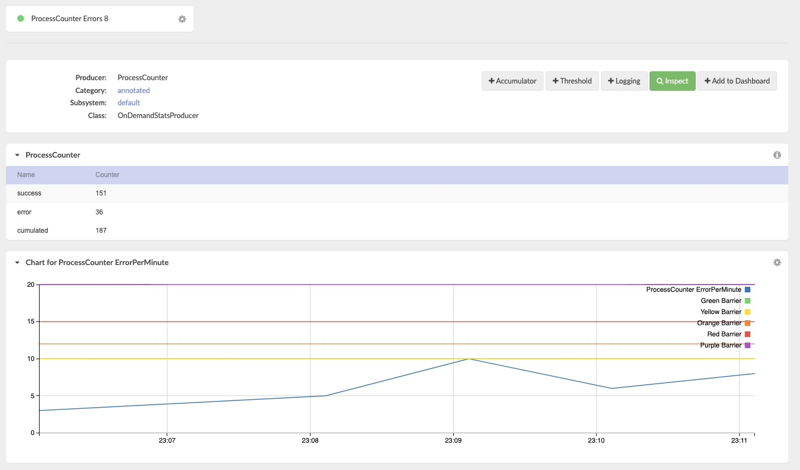

## What is this about

This is a rather small example on working with @Counter annotation as well as custom-built counters.
It is useful to transmit some logical state of the system (in this example whether a batch job runs smoothly) to the monitoring system.

The is also an example configuration for a [Dashboard](src/main/resources/moskito.json) 
## How to run

1. Download the moskito-demo project and build it with maven or your favorite IDE.
2. From the IDE start `org.moskito.demo.recipes.counter.Daemon`
3. You will see an output like this:
```
Executing job, result 4 success: true
Executing job, result 0 success: true
Executing job, result 9 success: false
Executing job, result 1 success: true
Executing job, result 0 success: true
Executing job, result 2 success: true
Executing job, result 2 success: true
```

4. Download moskito-inspect (or obtain otherwise)
5. Run moskito inspect
6. Connect to you locally run instance of the daemon, i.e. (http://localhost:8088/moskito/moskito-inspect/mskShowProducer?pProducerId=ProcessCounter&remoteConnection=localhost%3A9401), assuming you run everything on default ports.
7. You should see the dashboard:


## What to learn

The Daemon class starts moskito-core directly (so you can connect to it with the moskito-inspect later) and creates an ExecutorService.
It submits a Job to this service, to be run every 2 seconds and emulate some activity.
```
	@Override
	public void run() {
		int result = rnd.nextInt(10);
		boolean success = result < 8;
		System.out.println("Executing job, result "+result+" success: "+success);
		if (success){
			counter.success();
		}else{
			counter.error();
		}
	}
```
Every job run that produces a number below 8 is successful. Otherwise the job is considered a failure.
Using an empty method call on a surrogate object, the system transmits its state to the monitoring:
```
@Count(producerId = "ProcessCounter")
public class Counter {
	/**
	 * Call this method when the process has been successful.
	 */
	public void success(){

	}

	/**
	 * Call this method when the process has finished with an error.
	 */
	public void error(){
		
	}
}
```      

Additional example is provided on custom built counters.